# Diagrammi del progetto

Diagrammi generati a partire dallo schema reale (`database/schema.sql`, 31 tabelle) e dal codice del backend (`server/routes/`, `server/controllers/`, `server/middleware/authMiddleware.js`).

## Diagramma Entità-Relazione (ER)

Sono rappresentate tutte le tabelle presenti in `database/schema.sql`, con le relative chiavi primarie (PK), chiavi esterne (FK) e vincoli di unicità (UK) così come definiti nelle sezioni `ALTER TABLE ... ADD CONSTRAINT` dello schema.

> Nota: `escalation_pratiche`, `analisi_ai_ticket`, `analisi_ai_specialisti` e `assegnazioni_tecniche` sono presenti nello schema con i relativi vincoli di integrità referenziale, ma non risultano referenziate da alcun controller in `server/controllers/` (verificato con una ricerca nel codice): sono predisposizioni per funzionalità non ancora implementate nel backend. `valutazioni_tecniche` è invece letta da `technicalCommunicationController.js` ma non risulta scritta da nessun controller individuato.

```mermaid
erDiagram
    UTENTI {
        int id PK
        string nome
        string cognome
        string email UK
        string telefono
        string password_hash
        string ruolo
        boolean puo_gestire_operatori
        boolean attivo
    }

    BARCHE {
        int id PK
        int utente_id FK
        string modello
        string matricola UK
        int anno_produzione
        date garanzia_scadenza_il
    }

    TICKET {
        int id PK
        int utente_id FK
        int barca_id FK
        int operatore_id FK
        string titolo
        text descrizione
        string categoria
        string tipo_richiesta
        string copertura
        decimal costo
        string stato
        string priorita
    }

    TICKET_VOCI {
        int id PK
        int ticket_id FK
        int categoria_componente_id FK
        int numero_voce UK
        string tipo_voce
        text descrizione_problema
    }

    CATEGORIE_COMPONENTI {
        int id PK
        string codice UK
        string nome
        boolean attiva
    }

    TICKET_ALLEGATI {
        int id PK
        int ticket_id FK
        int ticket_voce_id FK
        int caricato_da FK
        string tipo
        string nome_file_salvato UK
        boolean visibile_cliente
    }

    COMMENTI {
        int id PK
        int ticket_id FK
        int utente_id FK
        text testo
    }

    STORICO_STATI {
        int id PK
        int ticket_id FK
        int operatore_id FK
        string stato_precedente
        string stato_nuovo
    }

    STORICO_WORKFLOW {
        int id PK
        int ticket_id FK
        int modificato_da FK
        string fase_precedente
        string fase_nuova
    }

    WORKFLOW_PRATICHE {
        int id PK
        int ticket_id FK UK
        string fase
        string disponibilita_magazzino
        int aggiornato_da FK
    }

    NOTIFICHE {
        int id PK
        int utente_id FK
        int ticket_id FK
        string tipo
        string messaggio
        boolean letta
    }

    PASSWORD_RESET_TOKENS {
        int id PK
        int utente_id FK
        string token_hash UK
        datetime scade_il
        boolean utilizzato
    }

    CONSULTAZIONI_TICKET {
        int id PK
        int ticket_id FK
        int richiesta_da FK
        int consulente_id FK
        text richiesta
        text risposta
        string stato
    }

    RISPOSTE_CONSULTAZIONI {
        int id PK
        int consultazione_id FK
        int autore_id FK
        text testo
    }

    ALLEGATI_CONSULTAZIONI {
        int id PK
        int consultazione_id FK
        int risposta_id FK
        int caricato_da FK
        string nome_file
    }

    RICHIESTE_INTERNE_TICKET {
        int id PK
        int ticket_id FK
        int richiesto_da FK
        int assegnato_a FK
        text richiesta
        string stato
    }

    RISPOSTE_INTERNE_TICKET {
        int id PK
        int richiesta_interna_id FK
        int autore_id FK
        text testo
        boolean visibile_cliente
    }

    DOCUMENTI_TICKET {
        int id PK
        int ticket_id FK
        int ric_id FK
        int caricato_da FK
        string tipo
        string nome_file_salvato UK
        boolean visibile_cliente
    }

    RIC {
        int id PK
        int ticket_id FK
        int barca_id FK
        int caricato_da FK
        string numero_ric UK
        string causale
    }

    RIC_RIGHE {
        int id PK
        int ric_id FK
        string codice_articolo
        text descrizione
        decimal quantita
    }

    PRATICHE_RICAMBI {
        int id PK
        int ticket_id FK UK
        string numero_ric
        string stato_pratica
    }

    ARTICOLI_COMMERCIALI_TICKET {
        int id PK
        int ticket_id FK
        string codice_articolo
        decimal costo_articolo
        int quantita
    }

    COMUNICAZIONI_TECNICHE_CLIENTE {
        int id PK
        int ticket_id FK
        int valutazione_origine_id FK
        int operatore_id FK
        string titolo
        string stato
    }

    ESCALATION_PRATICHE {
        int id PK
        int ticket_id FK
        int richiesta_da FK
        int assegnata_a FK
        string tipo
        string destinatario
        string stato
    }

    ASSEGNAZIONI_TECNICHE {
        int id PK
        int ticket_id FK
        int assegnato_a FK
        int assegnato_da FK
        int valutazione_origine_id FK
        string stato
    }

    VALUTAZIONI_TECNICHE {
        int id PK
        int assegnazione_id FK
        int autore_id FK
        int approvata_da FK
        string esito
        string stato
    }

    VALUTAZIONI_SERVIZIO {
        int id PK
        int ticket_id FK UK
        int utente_id FK
        int qualita_prodotto
        int tempistiche
        int servizio_cliente
    }

    SPECIALIZZAZIONI {
        int id PK
        string nome UK
    }

    CATEGORIE_SPECIALIZZAZIONI {
        int categoria_id PK,FK
        int specializzazione_id PK,FK
        string tipo_competenza
    }

    UTENTI_SPECIALIZZAZIONI {
        int utente_id PK,FK
        int specializzazione_id PK,FK
    }

    ANALISI_AI_TICKET {
        int id PK
        int ticket_id FK
        int ticket_voce_id FK
        int categoria_suggerita_id FK
        int condivisa_da FK
        int revisionata_da FK
        string stato
    }

    ANALISI_AI_SPECIALISTI {
        int analisi_id PK,FK
        int specializzazione_id PK,FK
        string tipo_suggerimento
    }

    UTENTI ||--o{ BARCHE : possiede
    UTENTI ||--o{ TICKET : "apre (utente_id)"
    UTENTI ||--o{ TICKET : "gestisce (operatore_id)"
    BARCHE ||--o{ TICKET : riguarda
    UTENTI ||--o{ COMMENTI : scrive
    TICKET ||--o{ COMMENTI : riceve
    TICKET ||--o{ TICKET_VOCI : contiene
    CATEGORIE_COMPONENTI ||--o{ TICKET_VOCI : classifica
    TICKET ||--o{ TICKET_ALLEGATI : include
    TICKET_VOCI ||--o{ TICKET_ALLEGATI : documenta
    UTENTI ||--o{ TICKET_ALLEGATI : carica
    TICKET ||--o{ STORICO_STATI : traccia
    UTENTI ||--o{ STORICO_STATI : registra
    TICKET ||--o{ STORICO_WORKFLOW : traccia
    UTENTI ||--o{ STORICO_WORKFLOW : registra
    TICKET ||--|| WORKFLOW_PRATICHE : ha
    UTENTI ||--o{ WORKFLOW_PRATICHE : aggiorna
    UTENTI ||--o{ NOTIFICHE : riceve
    TICKET ||--o{ NOTIFICHE : genera
    UTENTI ||--o{ PASSWORD_RESET_TOKENS : richiede
    TICKET ||--o{ CONSULTAZIONI_TICKET : richiede
    UTENTI ||--o{ CONSULTAZIONI_TICKET : "richiede (richiesta_da)"
    UTENTI ||--o{ CONSULTAZIONI_TICKET : "risponde (consulente_id)"
    CONSULTAZIONI_TICKET ||--o{ RISPOSTE_CONSULTAZIONI : riceve
    UTENTI ||--o{ RISPOSTE_CONSULTAZIONI : scrive
    CONSULTAZIONI_TICKET ||--o{ ALLEGATI_CONSULTAZIONI : include
    RISPOSTE_CONSULTAZIONI ||--o{ ALLEGATI_CONSULTAZIONI : include
    UTENTI ||--o{ ALLEGATI_CONSULTAZIONI : carica
    TICKET ||--o{ RICHIESTE_INTERNE_TICKET : genera
    UTENTI ||--o{ RICHIESTE_INTERNE_TICKET : "richiede (richiesto_da)"
    UTENTI ||--o{ RICHIESTE_INTERNE_TICKET : "riceve (assegnato_a)"
    RICHIESTE_INTERNE_TICKET ||--o{ RISPOSTE_INTERNE_TICKET : riceve
    UTENTI ||--o{ RISPOSTE_INTERNE_TICKET : scrive
    TICKET ||--o{ DOCUMENTI_TICKET : include
    RIC ||--o{ DOCUMENTI_TICKET : genera
    UTENTI ||--o{ DOCUMENTI_TICKET : carica
    TICKET ||--o{ RIC : genera
    BARCHE ||--o{ RIC : riguarda
    UTENTI ||--o{ RIC : carica
    RIC ||--o{ RIC_RIGHE : contiene
    TICKET ||--|| PRATICHE_RICAMBI : ha
    TICKET ||--o{ ARTICOLI_COMMERCIALI_TICKET : include
    TICKET ||--o{ COMUNICAZIONI_TECNICHE_CLIENTE : riceve
    UTENTI ||--o{ COMUNICAZIONI_TECNICHE_CLIENTE : invia
    VALUTAZIONI_TECNICHE ||--o{ COMUNICAZIONI_TECNICHE_CLIENTE : origina
    TICKET ||--o{ ESCALATION_PRATICHE : genera
    UTENTI ||--o{ ESCALATION_PRATICHE : "richiede (richiesta_da)"
    UTENTI ||--o{ ESCALATION_PRATICHE : "gestisce (assegnata_a)"
    TICKET ||--o{ ASSEGNAZIONI_TECNICHE : genera
    UTENTI ||--o{ ASSEGNAZIONI_TECNICHE : "assegna (assegnato_da)"
    UTENTI ||--o{ ASSEGNAZIONI_TECNICHE : "riceve (assegnato_a)"
    VALUTAZIONI_TECNICHE ||--o{ ASSEGNAZIONI_TECNICHE : origina
    ASSEGNAZIONI_TECNICHE ||--o{ VALUTAZIONI_TECNICHE : produce
    UTENTI ||--o{ VALUTAZIONI_TECNICHE : "scrive (autore_id)"
    UTENTI ||--o{ VALUTAZIONI_TECNICHE : "approva (approvata_da)"
    TICKET ||--|| VALUTAZIONI_SERVIZIO : riceve
    UTENTI ||--o{ VALUTAZIONI_SERVIZIO : compila
    CATEGORIE_COMPONENTI ||--o{ CATEGORIE_SPECIALIZZAZIONI : ha
    SPECIALIZZAZIONI ||--o{ CATEGORIE_SPECIALIZZAZIONI : copre
    UTENTI ||--o{ UTENTI_SPECIALIZZAZIONI : possiede
    SPECIALIZZAZIONI ||--o{ UTENTI_SPECIALIZZAZIONI : assegnata
    TICKET ||--o{ ANALISI_AI_TICKET : genera
    TICKET_VOCI ||--o{ ANALISI_AI_TICKET : analizzata_in
    CATEGORIE_COMPONENTI ||--o{ ANALISI_AI_TICKET : suggerisce
    UTENTI ||--o{ ANALISI_AI_TICKET : "condivide (condivisa_da)"
    UTENTI ||--o{ ANALISI_AI_TICKET : "revisiona (revisionata_da)"
    ANALISI_AI_TICKET ||--o{ ANALISI_AI_SPECIALISTI : suggerisce
    SPECIALIZZAZIONI ||--o{ ANALISI_AI_SPECIALISTI : indicata
```

## Diagramma dei casi d'uso

Mermaid non include un tipo di diagramma UML "use case" nativo: la rappresentazione seguente usa un flowchart (attori come nodi arrotondati, casi d'uso come nodi a "stadio"), il workaround standard per questo tipo di diagramma in Mermaid. I casi d'uso sono ricavati dalle rotte reali in `server/routes/` e dai controlli di ruolo in `server/middleware/authMiddleware.js` (`requireAuth`, `requireOperator`, `requireOperatorOrTechnician`, `requireOperatorManager`).

```mermaid
flowchart LR
    Utente(["👤 Utente / Cliente"])
    Operatore(["👤 Operatore"])
    Tecnico(["👤 Tecnico"])

    subgraph Autenticazione
        UC_Registrazione(["Registrarsi"])
        UC_Login(["Accedere"])
        UC_Logout(["Uscire"])
        UC_ResetPwd(["Recuperare / reimpostare password"])
    end

    subgraph Area Cliente
        UC_GestisciBarche(["Gestire le proprie imbarcazioni"])
        UC_CreaTicket(["Aprire un ticket con allegati"])
        UC_ViewTicket(["Visualizzare i propri ticket"])
        UC_Commenta(["Commentare un ticket"])
        UC_ViewDocCliente(["Visualizzare documenti/comunicazioni visibili"])
        UC_ConfermaRisoluzione(["Confermare risoluzione o segnalare persistenza"])
        UC_Notifiche(["Ricevere notifiche"])
    end

    subgraph Gestione Operativa
        UC_ViewAllTicket(["Visualizzare tutti i ticket"])
        UC_GestisciTicket(["Gestire stato, priorità, assegnazione e costo"])
        UC_GestisciBarcheTutte(["Gestire imbarcazioni di tutti i clienti"])
        UC_GestisciOperatori(["Gestire operatori (operatore principale)"])
        UC_RichiediConsulenza(["Richiedere consultazione tecnica"])
        UC_RichiesteInterne(["Gestire richieste interne"])
        UC_CaricaDocumenti(["Caricare documenti e comunicazioni tecniche"])
        UC_GestisciRIC(["Gestire Richieste Interne Componenti - RIC"])
        UC_Storico(["Visualizzare storico stati"])
    end

    subgraph Consulenza Tecnica
        UC_ViewTicketConsultato(["Visualizzare ticket con consultazione ricevuta"])
        UC_RispondiConsulenza(["Rispondere a una consultazione con allegati"])
    end

    Utente --> UC_Registrazione
    Utente --> UC_Login
    Utente --> UC_Logout
    Utente --> UC_ResetPwd
    Utente --> UC_GestisciBarche
    Utente --> UC_CreaTicket
    Utente --> UC_ViewTicket
    Utente --> UC_Commenta
    Utente --> UC_ViewDocCliente
    Utente --> UC_ConfermaRisoluzione
    Utente --> UC_Notifiche

    Operatore --> UC_Login
    Operatore --> UC_Logout
    Operatore --> UC_ResetPwd
    Operatore --> UC_ViewAllTicket
    Operatore --> UC_GestisciTicket
    Operatore --> UC_GestisciBarcheTutte
    Operatore --> UC_GestisciOperatori
    Operatore --> UC_RichiediConsulenza
    Operatore --> UC_RichiesteInterne
    Operatore --> UC_CaricaDocumenti
    Operatore --> UC_GestisciRIC
    Operatore --> UC_Storico
    Operatore --> UC_Commenta
    Operatore --> UC_Notifiche

    Tecnico --> UC_Login
    Tecnico --> UC_Logout
    Tecnico --> UC_ResetPwd
    Tecnico --> UC_ViewTicketConsultato
    Tecnico --> UC_RispondiConsulenza
```



> Nota di autorizzazione: l'accesso di Utente e Tecnico ai casi d'uso su un ticket specifico è limitato dal backend rispettivamente alla proprietà del ticket (`utente_id`) e all'esistenza di una consultazione in `consultazioni_ticket` (`consulente_id`) — verificato in `commentController.js`, `attachmentController.js`, `historyController.js` e `ticketController.js`.
